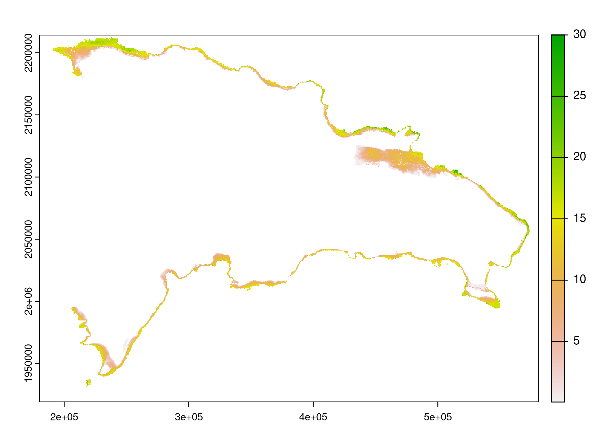
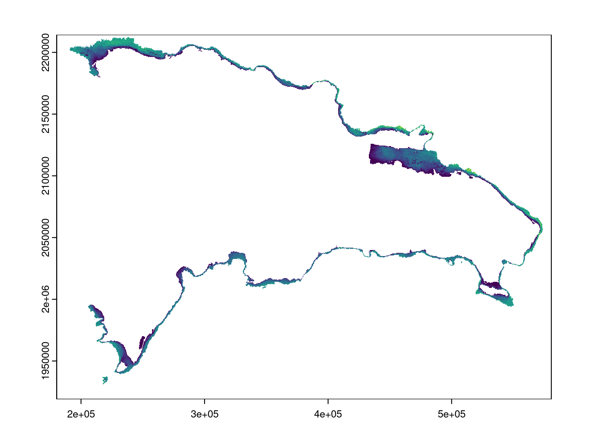
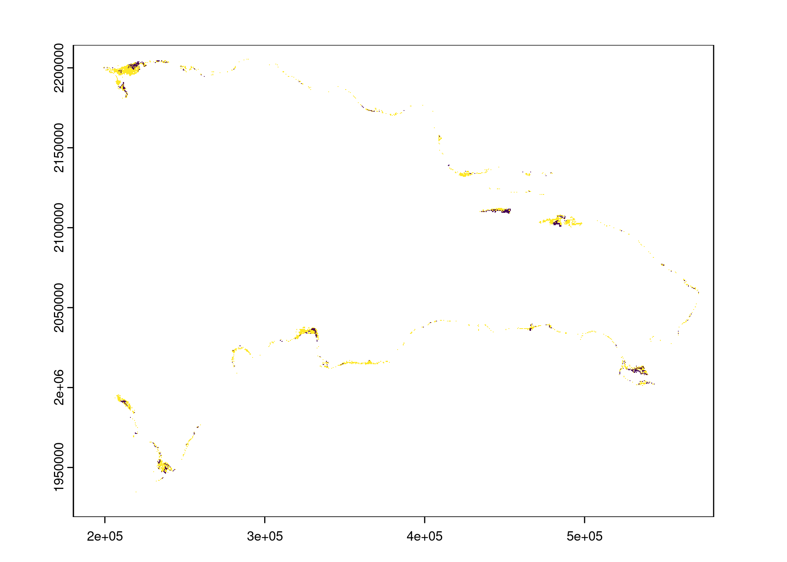

Análisis de idoneidad de hábitat para manatíes utilizando el proceso
analítico jerárquico y técnicas geoespaciales. Fuentes geoespaciales
================

# Introducción

El hábitat es un determinante fundamental para la supervivencia y
prosperidad de cualquier especie animal. En el caso de los manatíes,
animales acuáticos sumamente vulnerables, la preservación de su hábitat
es crítica para su supervivencia. Sin embargo, la evaluación precisa del
hábitat de los manatíes plantea retos debido a la falta de un marco
analítico sistemático y a la carencia de herramientas adecuadas para tal
fin.

En este estudio, abordamos estos desafíos mediante la aplicación del
Proceso Analítico Jerárquico (AHP, por sus siglas en inglés) y técnicas
geoespaciales para el análisis de idoneidad del hábitat para manatíes
(Thomas L. Saaty 2001; Thomas L. Saaty y Tran 2007; Thomas L. Saaty
1977). El AHP es una técnica multicriterio que facilita la toma de
decisiones en situaciones complejas, permitiendo la descomposición de un
problema en un sistema de jerarquías. En el ámbito de la conservación de
la vida silvestre, esta técnica puede ser invaluable para evaluar y
priorizar áreas de hábitat basándose en diversos factores que
contribuyen a la idoneidad del hábitat.

Además, las técnicas geoespaciales, como los Sistemas de Información
Geográfica (SIG) y el Análisis Espacial, permiten la representación
visual y la manipulación de los datos de ubicación. Estas técnicas,
combinadas con el AHP, proporcionan un enfoque potente para la
evaluación de la idoneidad del hábitat de los manatíes.

En resumen, este estudio busca proporcionar un marco integral y
metodológicamente sólido para la evaluación de la idoneidad del hábitat
de los manatíes. Con la adopción de herramientas sencillas y accesibles,
como QGIS, y la incorporación de técnicas avanzadas como el AHP y el
análisis espacial, esperamos que esta investigación contribuya
significativamente al campo de la conservación de manatíes y a la
gestión efectiva de sus hábitats.

# Materiales, métodos y resultados

## Paquetes y funciones

``` r
library(terra)
library(sf)
library(kableExtra)
library(tidyverse)
library(gdalUtilities)
library(rgrass)
estilo_kable <- function(df, titulo = '', cubre_anchura = T) {
  df %>% kable(format = 'html', escape = F, booktabs = T, digits = 2, caption = titulo) %>%
  kable_styling(bootstrap_options = c("hover", "condensed"), full_width = cubre_anchura)
}
grass_flags <- c('overwrite', 'quiet')
ruta_fuentes <- 'fuentes/MAPA 1_HABITAT OPTIMO/'
```

## Preparación de los datos base

Primero extraemos, reproyectamos y remuestreamos (reducimos resolución,
de 10 a 100 m) la capa de batimetría a UTM con GDAL (GDAL/OGR
contributors 2022). Luego borramos la fuente detallada (la de 10 m).

``` r
ruta_bat <- paste0(ruta_fuentes, 'BatimetriaSRC.tif')
ruta_bat_utm <- paste0(ruta_fuentes, 'BatimetriaSRC_32619.tif')
```

``` r
unzip(
  zipfile = paste0(ruta_fuentes, 'BatimetriaSRC.zip'),
  exdir = ruta_fuentes, junkpaths = T,
  unzip = '/usr/bin/unzip')
gdalwarp(
  srcfile = ruta_bat,
  dstfile = ruta_bat_utm,
  t_srs = 'EPSG:32619', # CRS de destino
  tr = c(100, 100), # Resolución de destino
  tap = TRUE, # Alinear a la cuadricula
  r = 'med', # Remuestreo por medio de mediana
  overwrite = T)
file.remove(ruta_bat)
```

Cargamos la capa a `R` como `SpatRast`.

``` r
bat <- rast(ruta_bat_utm)
plot(bat)
```



> IMPORTANTE. Ejecutar estas líneas SÓLO para cerrar la sesión de GRASS
> de forma apropiada. Útil al final del día, o antes de cerrar R. No es
> obligatorio hacerlo, más bien, es buena práctica.

``` r
unlink_.gislock()
```

## Creación de base de datos GRASS GIS (GISDBASE/LOCATION/MAPSET)

Creamos la base de datos de GRASS GIS, con localización y conjunto de
mapas incluido, usando la extensión y resolución de la capa de
batimetría como base de definición (GRASS Development Team 2022).

``` r
gisdbase <- 'bdgrass' #Base de datos de GRASS GIS
wd <- getwd() #Directorio de trabajo
wd
```

    ## [1] "/media/jose/datos/tesis-valeria-herrera/repo-gh/manaties-rd"

``` r
loc <- initGRASS(gisBase = "/usr/lib/grass82",
                 home = wd,
                 SG = bat,
                 gisDbase = paste(wd, gisdbase, sep = '/'),
                 location = 'rd',
                 mapset = "PERMANENT",
                 override = TRUE)
gmeta(g.proj_WKT = F) # Imprime información sobre la región activa de GRASS GIS
```

    ## gisdbase    /media/jose/datos/tesis-valeria-herrera/repo-gh/manaties-rd/bdgrass 
    ## location    rd 
    ## mapset      PERMANENT 
    ## rows        2953 
    ## columns     4004 
    ## north       2214300 
    ## south       1919000 
    ## west        180300 
    ## east        580700 
    ## nsres       100 
    ## ewres       100 
    ## projection  +proj=utm +zone=19 +datum=WGS84 +units=m +no_defs +type=crs

## Importar fuentes a GRASS GIS

### Capa de batimetría

Importamos el ráster con `r.import`.

``` r
# system('r.import --help') # Ayuda sobre la función
execGRASS(
  cmd = 'r.import',
  flags = grass_flags,
  input = ruta_bat_utm,
  output = 'batimetria')
```

Fijar máscara.

``` r
execGRASS(
  cmd = 'r.mask',
  flags = grass_flags,
  raster = 'batimetria')
system('g.list type=rast')
```

Representar, trayendo capa desde GRASS.

``` r
bat_g <- read_RAST('batimetria', flags = grass_flags)
plot(bat_g)
```



### Capa de praderas

Extraer de ZIP.

``` r
ruta_prad <- paste0(ruta_fuentes, 'PraderasSRC.shp')
ruta_prad_utm <- paste0(ruta_fuentes, 'PraderasSRC_32619.gpkg')
```

``` r
unzip(
  zipfile = paste0(ruta_fuentes, 'PraderasSRC.zip'),
  exdir = ruta_fuentes, junkpaths = T,
  unzip = '/usr/bin/unzip')
ogr2ogr(
  src_datasource_name = ruta_prad,
  dst_datasource_name = ruta_prad_utm,
  s_srs = 'EPSG:4326', # CRS de origen
  t_srs = 'EPSG:32619', # CRS de destino
  f = 'GPKG',
  nlt = 'MULTIPOLYGON',
  overwrite = T)
file.remove(ruta_prad)
```

Importar a GRASS GIS.

``` r
system('v.import --help')
execGRASS(
  cmd = 'v.import',
  flags = grass_flags,
  input = ruta_prad_utm,
  output = 'praderas')
```

Convertir a ráster.

``` r
system('v.to.rast --help')
execGRASS(
  cmd = 'v.to.rast',
  flags = grass_flags,
  input = 'praderas',
  output = 'praderas',
  use = 'cat')
```

``` r
prad_g <- read_RAST('praderas', flags = grass_flags)
plot(prad_g)
```



## Cierre de la sesión de GRASS GIS

``` r
unlink_.gislock()
```

# Referencias

<div id="refs" class="references csl-bib-body hanging-indent">

<div id="ref-gdal2022gdal" class="csl-entry">

GDAL/OGR contributors. 2022. *GDAL/OGR Geospatial Data Abstraction
software Library*. Open Source Geospatial Foundation.
<https://doi.org/10.5281/zenodo.5884351>.

</div>

<div id="ref-GRASS_GIS_software" class="csl-entry">

GRASS Development Team. 2022. *Geographic Resources Analysis Support
System (GRASS) Software, Version 8.0.2*. USA: Open Source Geospatial
Foundation. <https://grass.osgeo.org>.

</div>

<div id="ref-saaty1977" class="csl-entry">

Saaty, Thomas L. 1977. «A Scaling Method for Priorities in Hierarchical
Structures». *Journal of Mathematical Psychology* 15 (3): 234-81.
<https://doi.org/10.1016/0022-2496(77)90033-5>.

</div>

<div id="ref-saaty2001" class="csl-entry">

Saaty, Thomas L. 2001. «Fundamentals of the Analytic Hierarchy Process».
En, editado por Daniel L. Schmoldt, Jyrki Kangas, Guillermo A. Mendoza,
y Mauno Pesonen, 3:15-35. Dordrecht: Springer Netherlands.
<http://link.springer.com/10.1007/978-94-015-9799-9_2>.

</div>

<div id="ref-saaty2007" class="csl-entry">

Saaty, Thomas L., y Liem T. Tran. 2007. «On the Invalidity of Fuzzifying
Numerical Judgments in the Analytic Hierarchy Process». *Mathematical
and Computer Modelling* 46 (7-8): 962-75.
<https://doi.org/10.1016/j.mcm.2007.03.022>.

</div>

</div>
